<p align="center">
  <h1 align="center">Investigating Multi-View Consistency of CLIP Features</h1>
  <p align="center">
    <a href="https://github.com/hannahcl">Hannah Laugaland</a><sup>1*</sup></span>, 
    <a href="https://danielkorth.io/">Daniel Korth</a><sup>2*</sup>
    <br>
    <sup>1</sup>Norwegian University of Science and Technology,
    <sup>2</sup>Technical University of Munich 
    <br>
    <sup>*</sup>Conducted during exchange at KAIST
  </p>
  <div align="center"></div>
</p>


This repository is part of the final project for the AI617 course held by [Prof. Joseph Lim](https://clvrai.com/web_lim/) at the Korean Advanced Institute of Science and Technology (KAIST).
Here, we investigate the multi-view consistency in CLIP features, propose several ideas to increase multi-view consistency, and discuss the results and challenges we face.

# Motivation & Problem Statement

The advancements in training on large-scale image data have led to the development of highly capable visual foundation models. These models exhibit strong generalization capabilities, offering valuable semantic information from 2D images. Recent efforts have aimed to extend the capabilities of these models into the 3D domain, such as in 3D generation [1] and scene understanding [2, 3]. Despite these advancements, the extent to which these foundation models truly comprehend 3D environments remains unclear. Particularly, Vision Language models like CLIP [4] and SigLIP [5] face challenges in understanding 3D environments and lack multi-view consistency [6].

In this project, we aim to investigate CLIP's multi-view (in-)consistency. Here, we consider a model to be multi-view consistent if it produces similar embeddings for images taken from different camera viewpoints. We believe that the lack of multi-view consistency in CLIP is due to the training data, which is primarily composed of single-view images. To address this, we propose to train a head on top of CLIP that enforces multi-view consistency. We evaluate our approach's effectiveness by measuring the learned features' multi-view consistency.

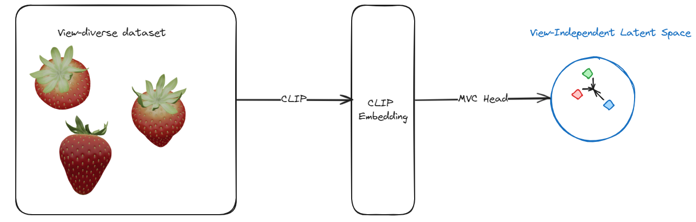

# Approach & Walkthrough

In the following, we walk through the steps to run our experiments and reproduce our results. We discuss our approach's challenges and design choices along the way. The repository is based on the [Lightning-Hydra-Template](https://github.com/ashleve/lightning-hydra-template).

### Quickstart

```bash
# initialize conda environment
conda create -n mvc-clip python=3.8
conda activate mvc-clip

# install requirements
pip install -r requirements.txt
pip install -e .
```
We conduct all our experiments on a single NVIDIA GeForce RTX 2080 Ti. The code is written in Python 3.8 and uses PyTorch 1.10.0.

### Dataset
The model should be trained on data that includes multiple views of the same object to train a multi-view consistent head. Also, images of the same object from different views must be related to each other. 
We use the [Objaverse](https://objaverse.allenai.org/objaverse-1.0) dataset, which provides 3D models of objects together with a caption. More specifically, we focus on the food and drinks category as this category provides the most descriptive captions. We use Blender to render images from these 3D models to create a multi-view dataset. We rendered every object from 6 different azimut angles and three different elevation angles, giving 36 images per object. Images and captions are then passed through the CLIP encoder to obtain embeddings.


Before starting, please add a `default.yaml` file in the `./configs/local` directory with the following content:
```yaml
base_dir: path/to/project/root
data_dir: ${local.base_dir}/data
objaverse_dir: ${local.data_dir}/objaverse
```

Then, you can run the following commands to download the dataset, render the data, and obtain CLIP embeddings:
```bash
# download the objaverse dataset (food & drinks subset)
python scripts/download_paths.py 
# render the data from different views
python scripts/render_data.py
# obtain CLIP embeddings
python scripts/get_vlm_embeddings.py +vlm='clip'
# generate train/val/test split
python scripts/generate_splits.py
```

### Baseline 
We compare our results to the original CLIP embeddings. For the baseline and all experiments, we compute and visualize
- Inter-Object Similarity (Cosine Similarity between image embeddings of the same object)
- Intra-Object Similarity (Cosine Similarity between image embeddings of different objects)
- Text-to-Image Similarity (Cosine Similarity between image embeddings and associated text embedding)

Mean and Standard Deviation are computed across all objects for Inter-Object Similarity. 

For every experiment, there will be a corresponding folder with logs and everything in the `logs` directory, with accompanying figures and metrics.
To evaluate the baseline, run the following command:
```bash
python scripts/train.py experiment=baseline
```

#### Inter-Object Similarity
<div align="center">
  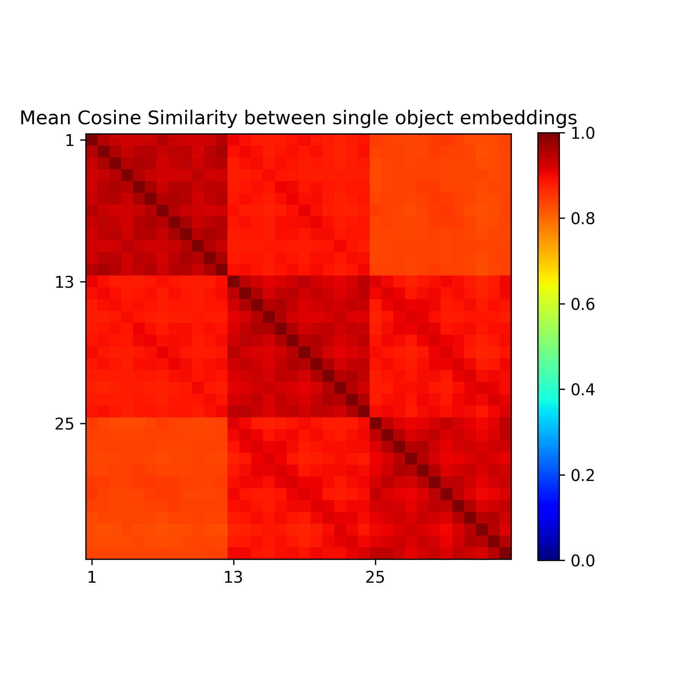
  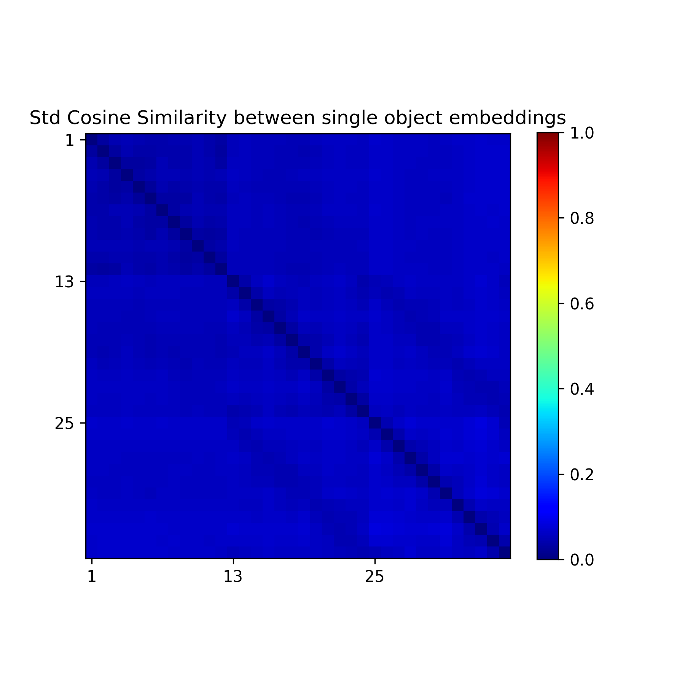 
</div>
There is perfect Similarity along the diagonal since this is the Similarity between the same image embeddings. We see nine distinct blocks. This is because every object is rendered from 3 different elevation angles, and 6 different azimut angels. The Similarity between images with the same elevation angle is noticeably higher. 


#### Intra-Object Mean Similarity
<div align="center">
    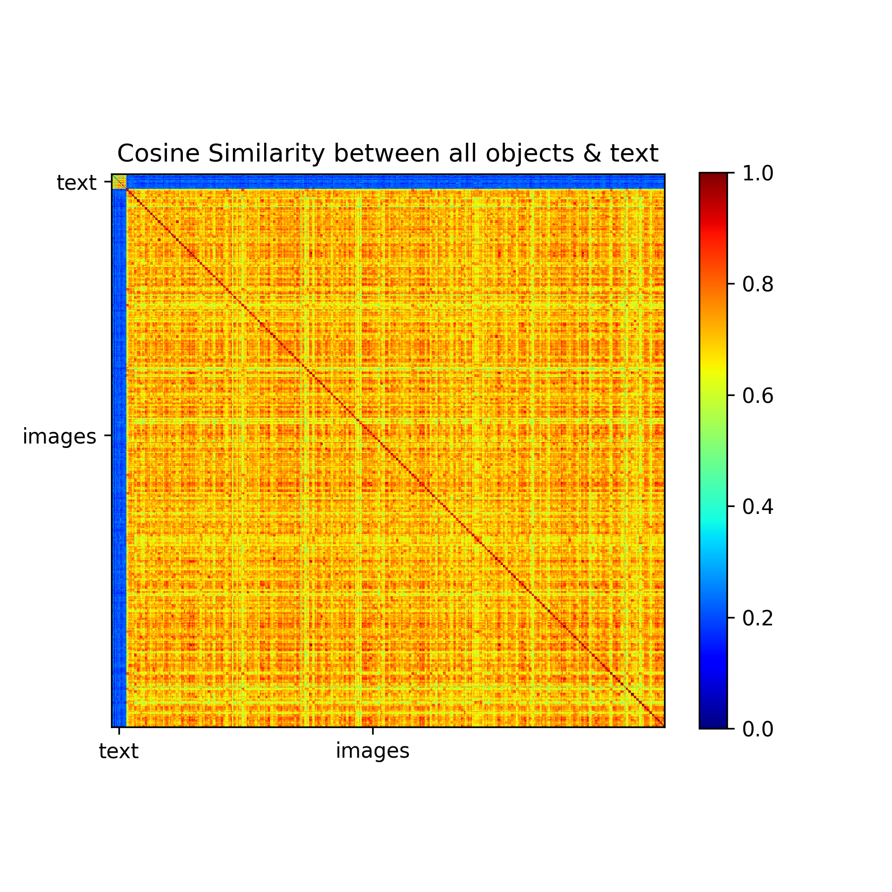
</div>
Along the diagonal, there are blocks with higher Similarity. These blocks correspond to the Similarity between the embeddings of the same object. The upper left block shows Text-to-Text Similarity. The long, narrow blocks on the top and the left show Text-to-Image Similarity. The Similarity between images from different objects is, generally, a high Text-to-Image Similarity, but there is large variation and little structure.

# Method
One of the main challenges is to define a suitable objective. Here, we present 3 different objective functions along with results and discussion.

## Object Head: Encouraging object Similarity
One approach is to formulate an objective that encourages Cosine Similarity between image embeddings of the same object. In order to avoid images from different objects being mapped to the same place, we regularize by encouraging Similarity between images and their associated text prompt.
The figure below shows a visualization of the loss function. Here, we have a small example with two different objects (denoted a and b), and each object has one text embedding (denoted T) and three image embeddings (denoted I). We compute the Cosine Similarity between all embeddings and sum up the elements marked in red. That is, the Cosine Similarity between all embeddings belonging to the same object.
<div align="center">
    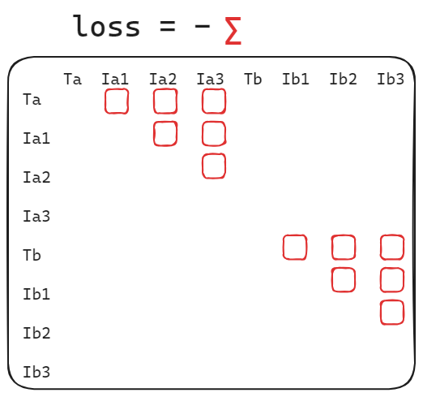
</div>

### Training
```bash
python scripts/train.py experiment=object
```
### Evaluation
#### Inter-Object Similarity
 <div align="center">
  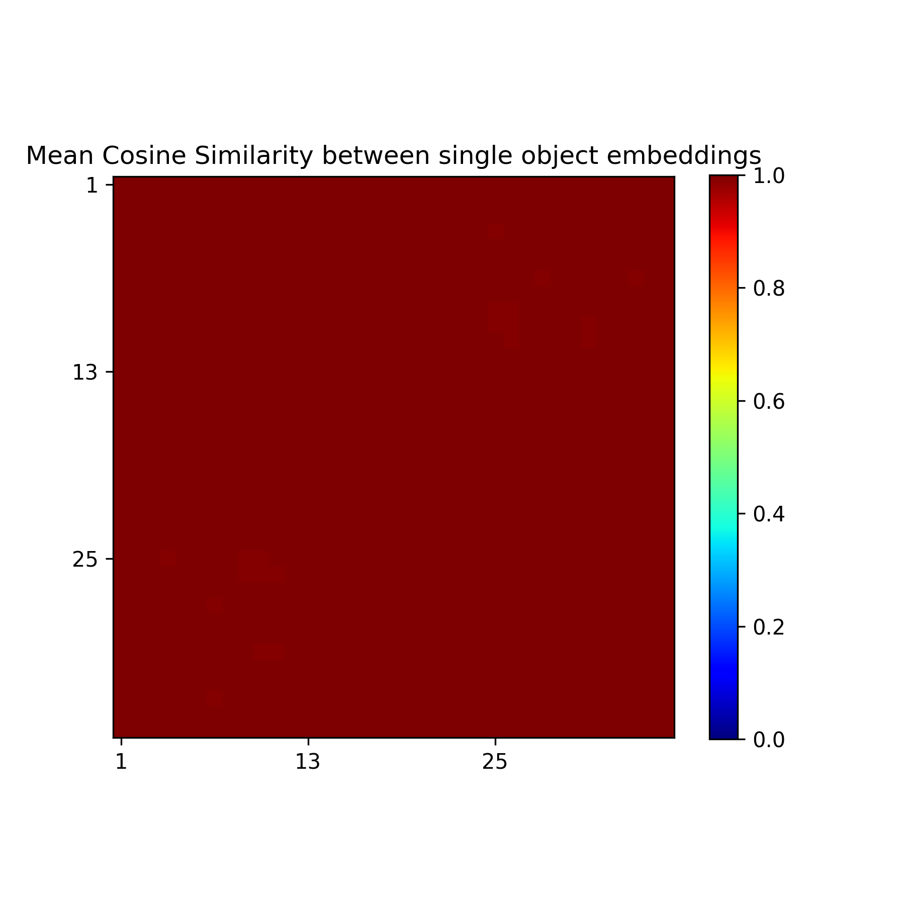
  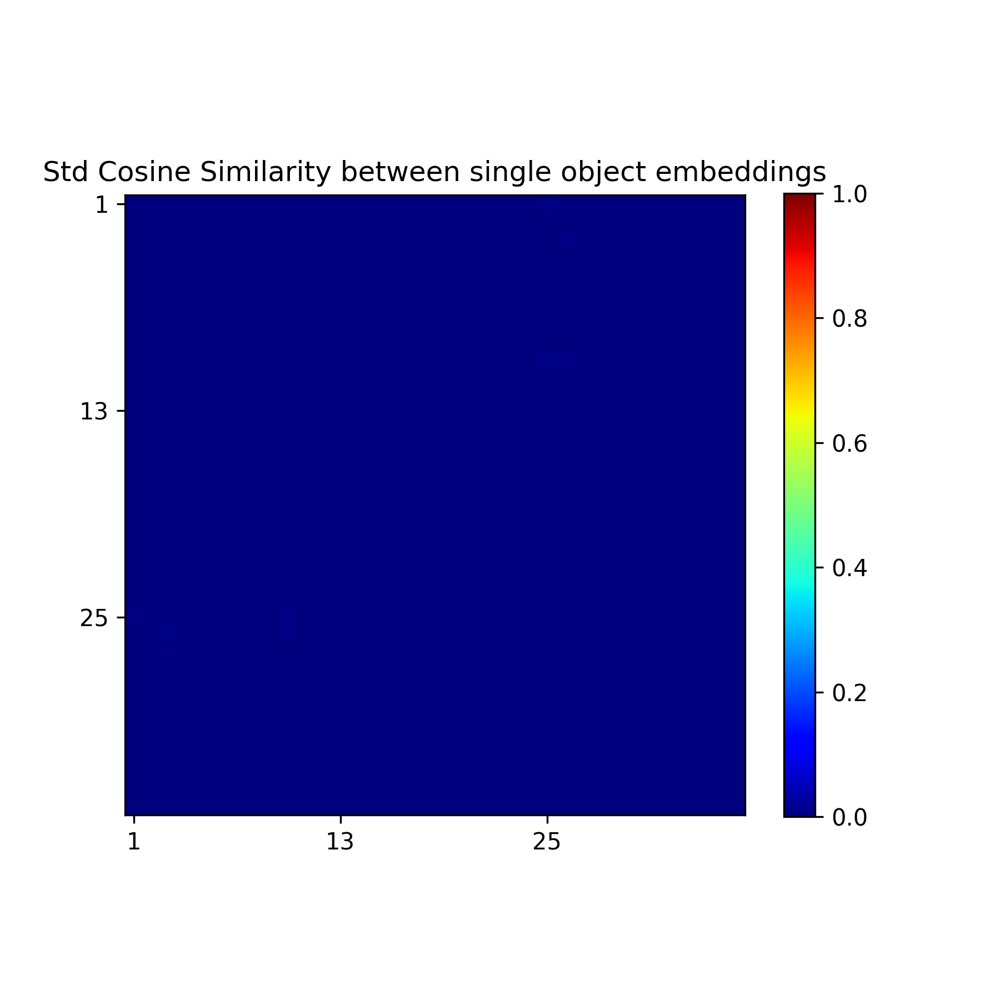 
</div>
The Similarity between image embeddings is perfect, and there is no variance across objects. 

#### Intra-Object Mean Similarity
<div align="center">
    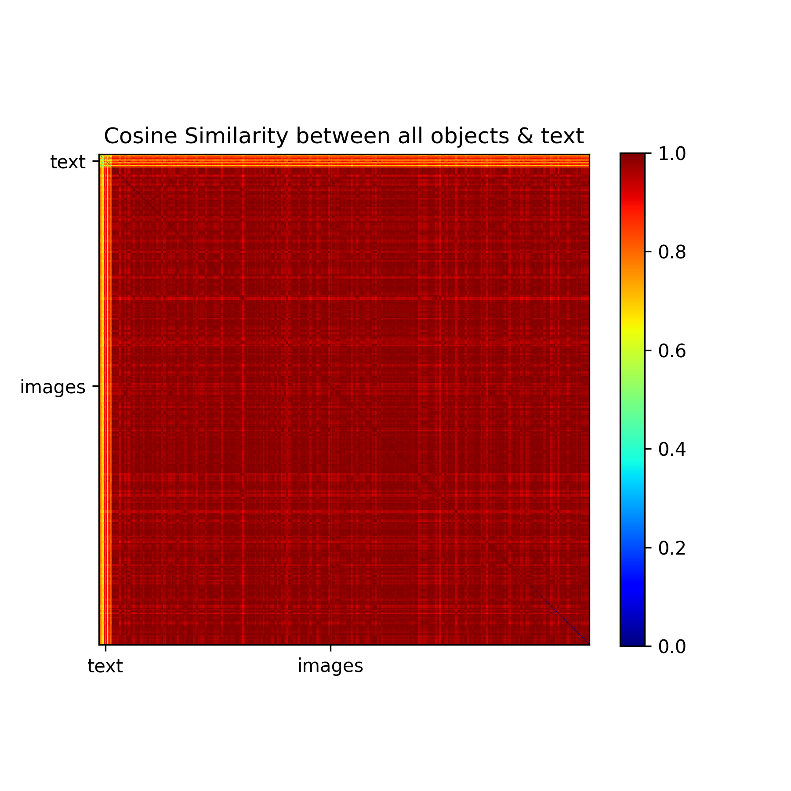
</div>
Image embeddings across images from different objects are perfect. Text-to-Image Similarity has increased compared to the baseline. 

### Discussion
The figures show that there is indeed a high Similarity between images of the same object. The problem is that images of different objects are also highly similar. 
One theory is that images and text prompts can be linearly divided in the shared latent space of CLIP. Moving an image embedding closer to its associated text embedding means moving it closer to all text embeddings. This means that more than encouraging Similarity between images and their associated text prompt is required to prevent all image embeddings from being mapped to the same point. 


### Contrastive Head: CLIP Objective Function augmented for multiple images of the same object
To address the shortcomings of the first proposal, we do a new experiment with contrastive learning. We hypothesize that the model will not collapse if we add a term in the objective function that encourages dissimilarity between embeddings unrelated to the same object.
This is very similar to the original CLIP objective, which has proven effective in associating semantically similar input. We want to test if it can also associate images from different views if provided with a view-diverse dataset.

The loss function is visualized in the figure below. Cosine similarities between embeddings that are not related to the same object are marked in blue. We want to minimize the sum of these elements.

<div align="center">
    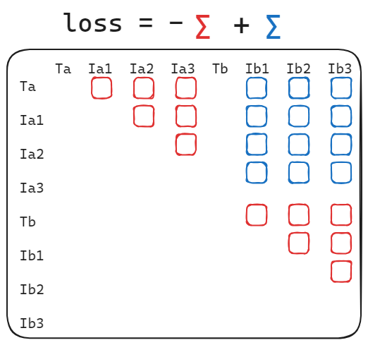
</div>

### Training
```bash
python scripts/train.py experiment=contrastive
```

### Evaluation
#### Inter-Object Similarity
<div align="center">
  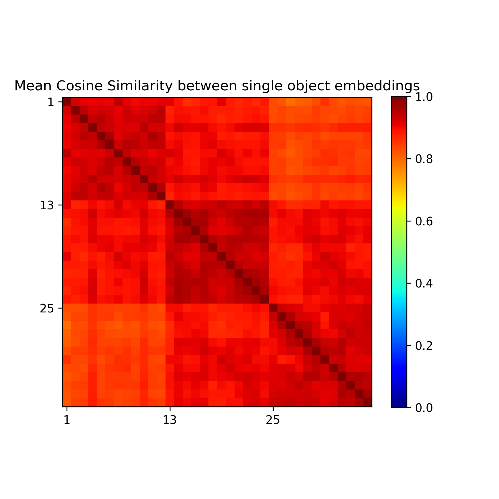
  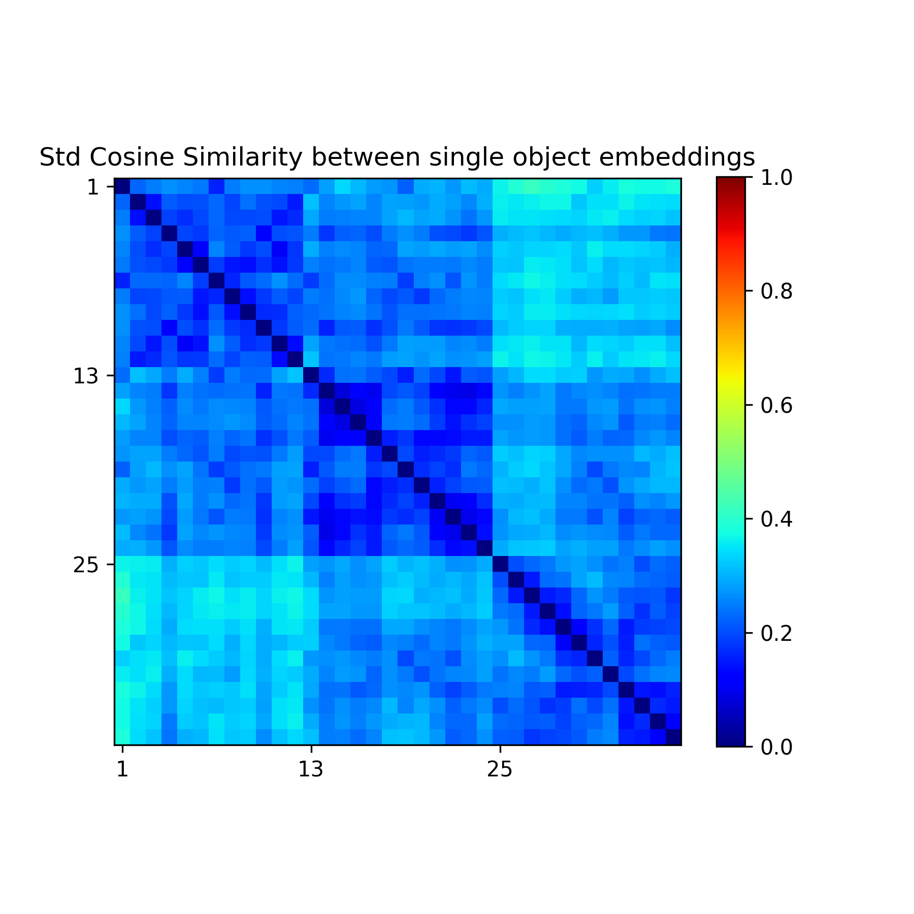 
</div>
Inter-Object Similarity is similar to baseline, though the variance across objects is higher.

#### Intra-Object Mean Similarity
<div align="center">
    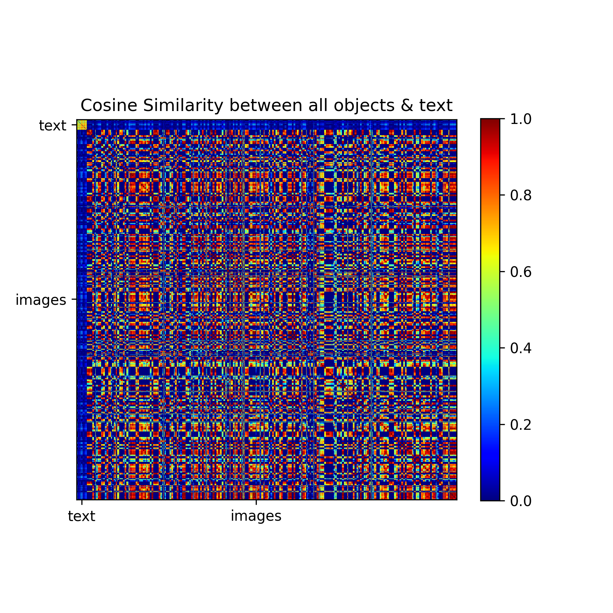
</div>
Similarity between embeddings of different objects has decreased significantly compared to the baseline.

### Discussion
We see that the similarity between text and object goes down a lot. It seems as though even when the objective function encourages Text-to-Image Similarity, this is not prioritized by the optimization problem. A strong decrease in Text-to-Image Similarity means that there is a loss of semantic information from the CLIP model.

An important limitation of the first two proposals is the inevitable loss of important semantic information from the original CLIP embeddings. When embeddings of images from different views are mapped closer to each other, we lose view-dependent information.

To summarize, this experiment exhibits close to no improvement in multi-view consistency, while semantic information is lost.

## Autoencoder: Separating view-dependent information from view-independent information
Here, we aim to separate view-dependent information from view-independent information, rather than saving only view-independent information. Secondly, we want to impose a constraint saying that semantic information should not be lost.
To do this, we use an autoencoder with two different encodings and decodings. One encoding should be multi-view consistent, while the other one should encode the remaining information which we assume to be view-dependent information. Adding the two decodings should result in the original CLIP embedding.

<div align="center">
    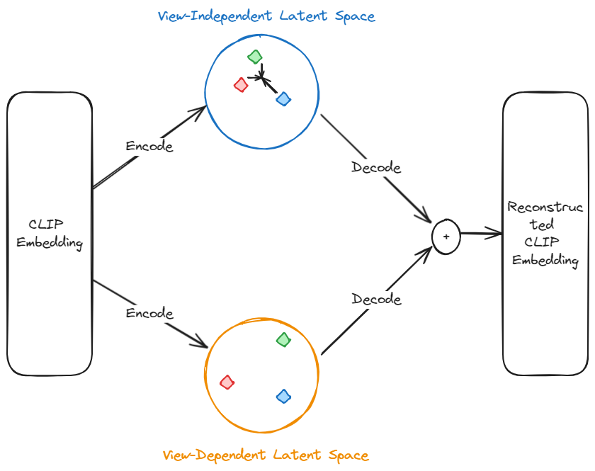
</div>

This way, information from the CLIP model is not lost, and the user additionally has access to the view-dependent and the view-independent versions of the embedding.
At test time, we do a forward pass only through the view-independent encoder/decoder, to filter out the view-dependent information. 

<div align="center">
    
</div>

### Training
```bash
python scripts/train.py experiment=autoencoder
```
### Evaluation
#### Inter-Object Similarity
<div align="center">
  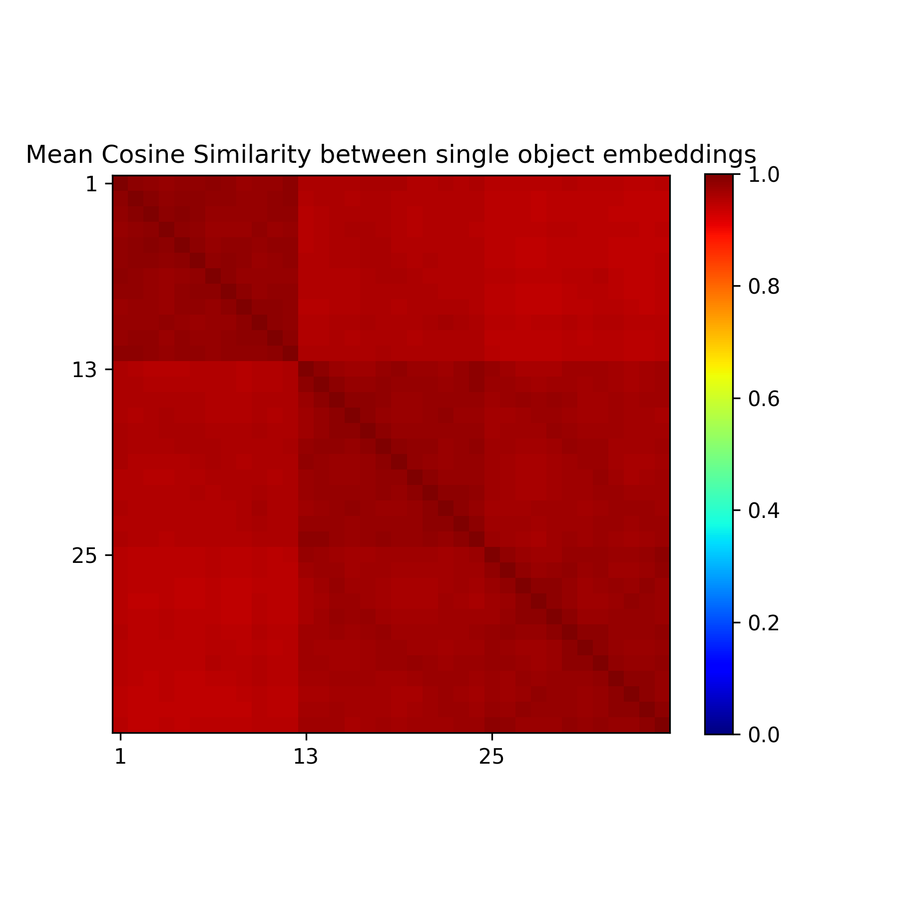
  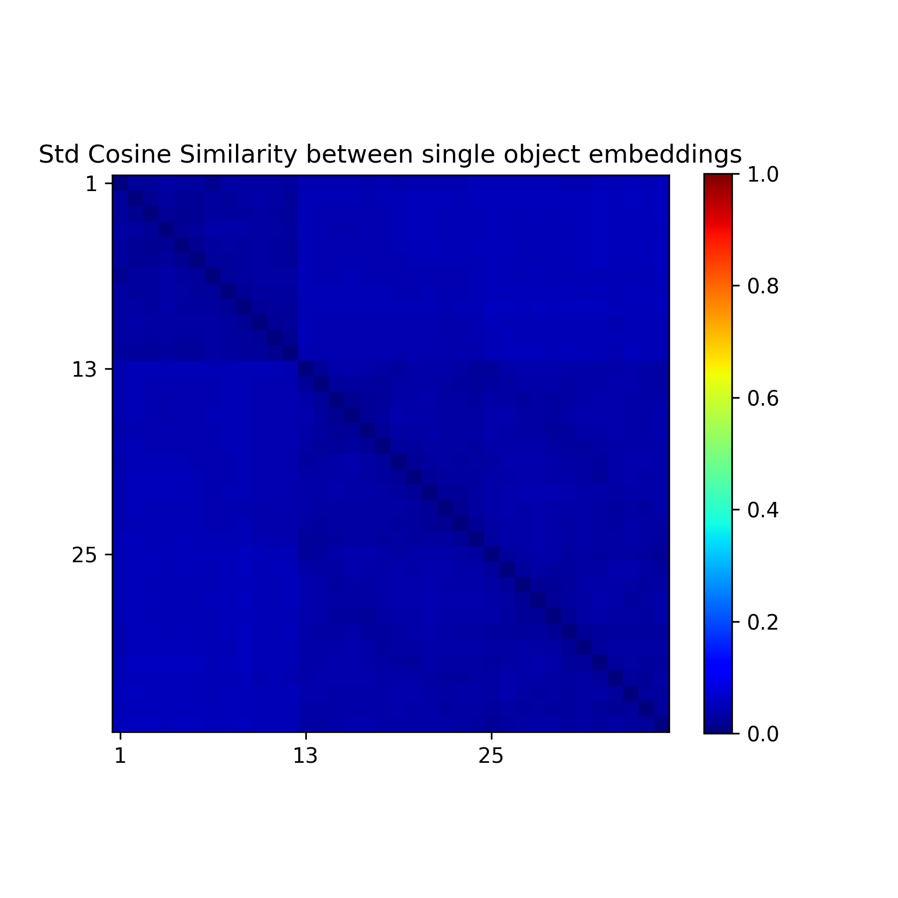 
</div>
Inter-Object Similarity is very similar to baseline, though the variance across objects is higher.

#### Intra-Object Mean Similarity
<div align="center">
    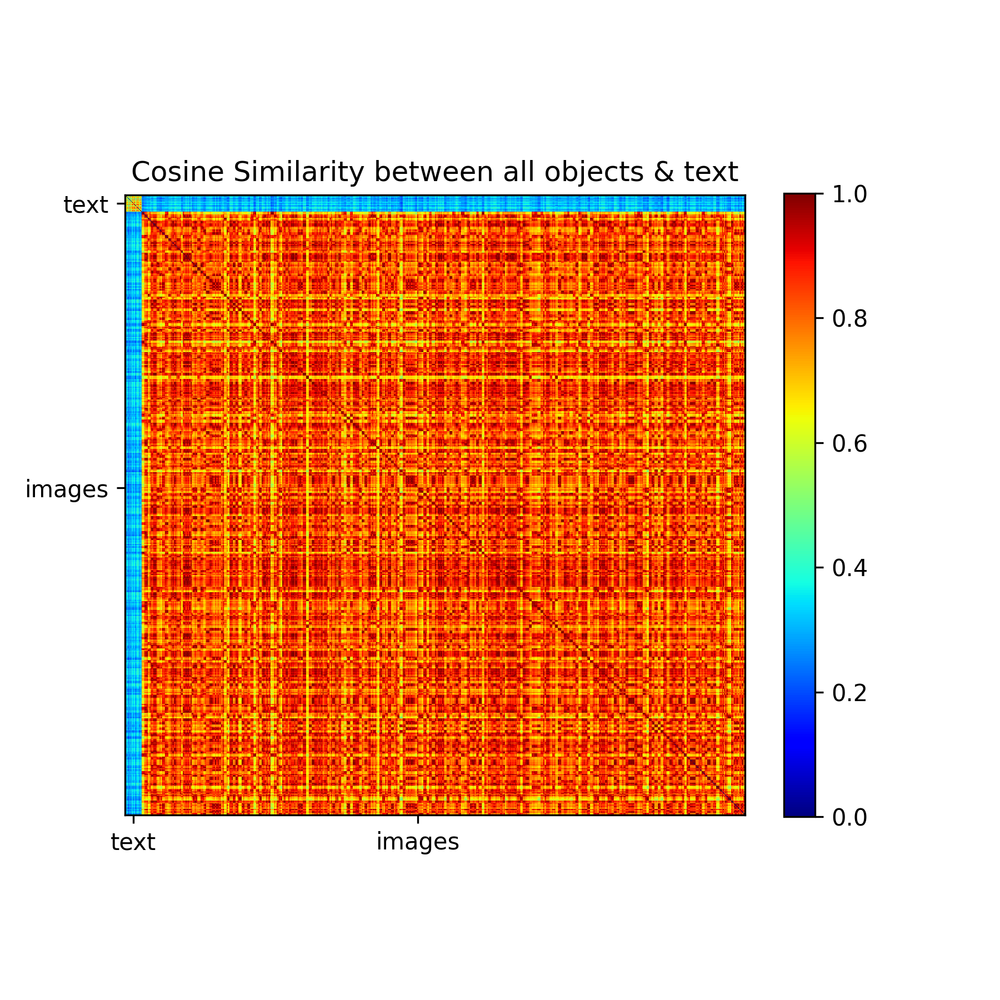
</div>
Similarity between embeddings of different objects has increased as well, but is far from model collapse as in experiment 1. 


### Discussion
This experiment shows promesing results as multi-view consistency is improved. 
On the other hand we observe a an average L2 distance of 0.17 between original embeddings and decodings. This metric is denoted as reconstruction loss in the config.


# Quantitative Results
|     | Inter-Object Similarity | Intra-Object Similarity | Text2Image Similarity |
| --- |-------------------------|------------------------|--------------------------|
| Baseline | 0.893 +/- 0.067 | 0.710 + 0.069 | 0.266 +/- 0.041 |
| Object Head | 0.997 +/- 0.003 | 0.978 +/- 0.015 | 0.822 +/- 0.087 |
| Contrastive Head | 0.895 +/- 0.266 | 0.021 +/- 0.676 | 0.137 +/-0.139 |
| Autoencoder| 0.965 +/- 0.043 | 0.827 +/- 0.094 | 0.323 +/- 0.039  |

We report the mean Cosine Similarity. +/- denotes the standard deviation across all objects.
We refer the reader to the codebase for specific hyperparameters, especially the config files.
For the Autoencoder, we observe a reconstruction loss of 0.17 in terms of L2 distance.

## Discussion
It is not straightforward to evaluate which approach is the best. In general, we want High Inter-Object Similarity as this entails multi-view consistency. At this same time we do not want model colapse as seen in the first experiment. If Text2Image similarity, and Intra-Object Similarity is similar to that of the baseline its an indication that semantic information from the CLIP model is retained. The same goes for the reconstruction loss in the case of the autoencoder. 
Based on this reasoning the autoencoder has the best performance.


# Challenges & Limitations
We identify following limitations in our approach:
- The dataset is limited to food and drinks, which is not be representative of all objects or the whole embedding space of CLIP.
- It is not clear how to decide which objectives should be used to measure multi-view consistency. We want high Inter-Object Similarity, but at the same time it should not be one since that means the model does not consider view-dependent effects at all.
- It is very hard to measure view-dependent and view-independent information when working only in the latent space of CLIP. We can only measure the effect of the view-dependent information by looking at the Similarity between images of the same object.

# Conclusion
In conclusion, we presented multiple ways to enhance the multi-view consistency of CLIP features by proposing additional heads trained on different loss functions. We are able to increase the Inter-Object Similarity of CLIP features, which however comes with the loss of view-dependent information and can lead to the model to collapse. We propose an autoencoder that separates view-dependent and view-independent information, which shows promising results in terms of multi-view consistency. However, the model is not able to fully separate view-dependent and view-independent information, and the reconstruction loss is relatively high. CLIP's multi-view consistency is a challenging problem, and further research is needed to fully understand the underlying mechanisms and to develop effective solutions.

# References

[1] Ben Poole, Ajay Jain, Jonathan T Barron, and Ben Mildenhall. Dreamfusion: Text-to-3d using 2d diffusion. arXiv preprint arXiv:2209.14988, 2022.

[2] Rui Huang, Songyou Peng, Ayca Takmaz, Federico Tombari, Marc Pollefeys, Shiji Song, Gao Huang, and Francis Engelmann. Segment3d: Learning fine-grained class-agnostic 3d segmentation without manual labels. arXiv preprint arXiv:2312.17232, 2023.

[3] Ayc¸a Takmaz, Elisabetta Fedele, Robert W Sumner, Marc Pollefeys, Federico Tombari, and Francis Engelmann. Openmask3d: Open-vocabulary 3d instance segmentation. arXiv preprint arXiv:2306.13631, 2023.

[4] Alec Radford, Jong Wook Kim, Chris Hallacy, Aditya Ramesh, Gabriel Goh, Sandhini Agarwal, Girish Sastry, Amanda Askell, Pamela Mishkin, Jack Clark, et al. Learning transferable visual models from natural language supervision. In International conference on machine learning, pages 8748–8763. PMLR, 2021.

[5] Xiaohua Zhai, Basil Mustafa, Alexander Kolesnikov, and Lucas Beyer. Sigmoid loss for language image pre-training. In Proceedings of the IEEE/CVF International Conference on Computer Vision, pages 11975–11986, 2023.

[6] Mohamed El Banani, Amit Raj, Kevis-Kokitsi Maninis, Abhishek Kar, Yuanzhen Li, Michael Rubinstein, Deqing Sun, Leonidas Guibas, Justin Johnson, and Varun Jampani. Probing the 3d awareness of visual foundation models, 2024.